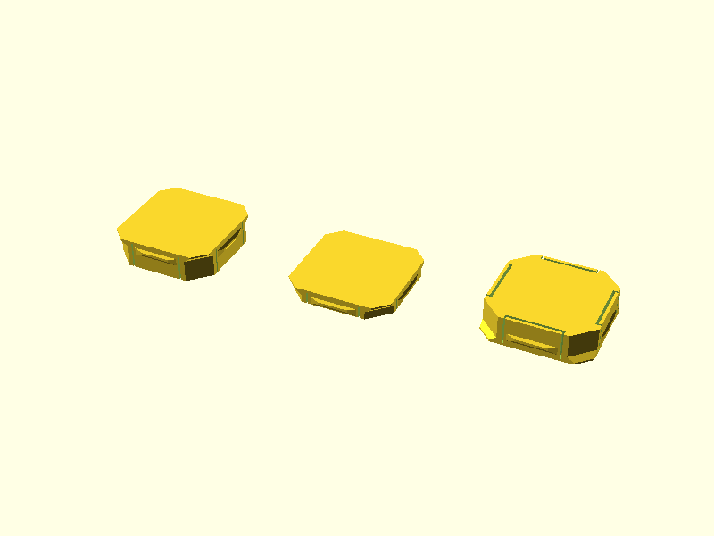
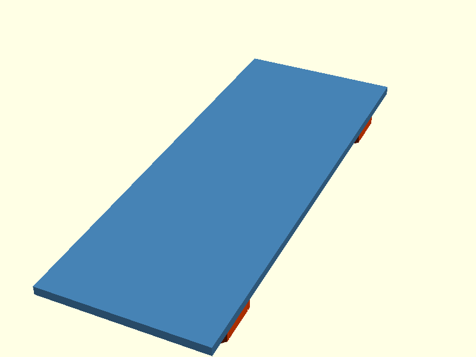
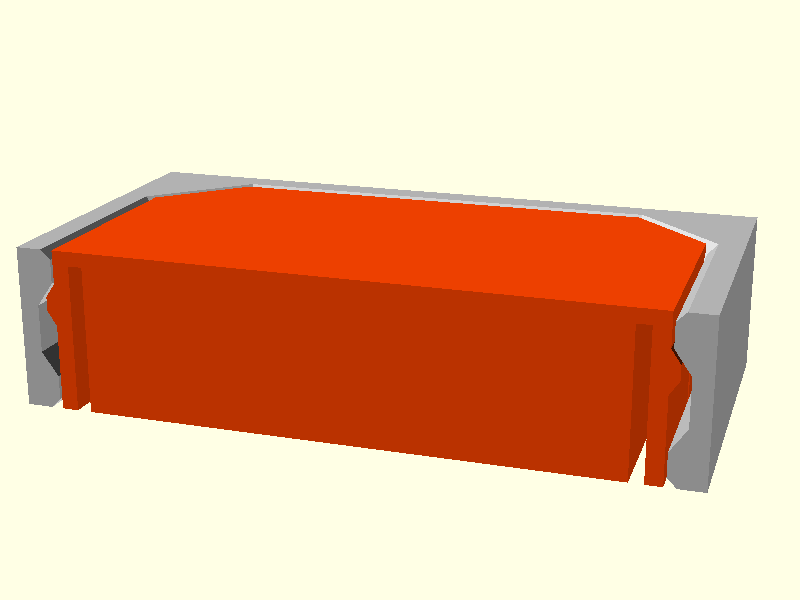
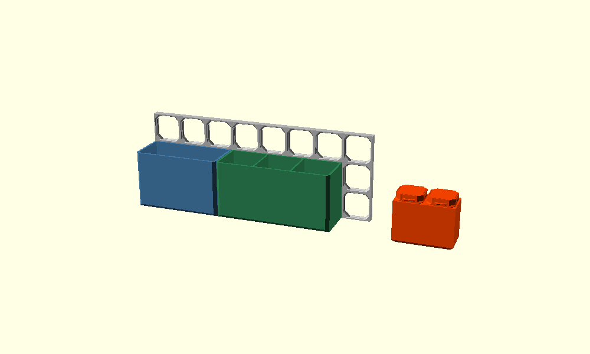

# OpenSCAD openGrid

Reusable OpenSCAD library for building [openGrid](https://www.opengrid.world/) compatible
accessories. Pure OpenSCAD primitives, no external dependencies.

It gives you the snap connector, a test tile and a ready made bin, so any product you
design can be mounted to an openGrid board without re-deriving the interface geometry
each time.

```scad
include <opengrid.scad>

// a 2 x 2 patch of snaps, front faces flush with z = 0
opengrid_snap_grid(2, 2);

// your product sits at z >= 0
translate([-28, -28, 0]) cube([56, 56, 3]);
```

---

## Coordinate convention

`z = 0` is the **front face of the board**. Product geometry lives at `z >= 0`,
snap geometry at `z <= 0`. Every internal dimension is quoted as a *depth* `d`
measured into the board, so a point at depth `d` sits at `z = -d`.

This means you can drop `opengrid_snaps(...)` straight into a union with a
backplate whose bottom face is on `z = 0` and it just works.

---

## Modules

### `opengrid_snap(lite, nubs, corner_clearance)`

One snap plug.

| Parameter | Default | Description |
|---|---|---|
| `lite` | `false` | `true` gives a 3.4 mm snap for a 4.0 mm Lite board |
| `nubs` | `true` | Fit the flexing retaining nubs. `false` gives a plain locating plug |
| `corner_clearance` | `0` | Shrinks the corner capture cone. `0` is the nominal conformal fit; try `0.05` to `0.1` if your printer runs fat |



*Left: full snap. Centre: lite snap. Right: full snap flipped to show the relief slots behind each nub.*

### `opengrid_snaps(positions, lite, nubs, corner_clearance)`

Snaps at a list of `[x, y]` centres. Use this when you want snaps only at
particular cells, for example the top and bottom rows of a tall backplate.



### `opengrid_snap_grid(cols, rows, lite, nubs, corner_clearance)`

A snap in every cell of a `cols` x `rows` patch, centred on the origin.

### `opengrid_tile(cols, rows, lite)`

A board patch for test fitting, front face on `z = 0`.

This carries the **cell profile only**. It is deliberately not a drop-in
replacement for a printed openGrid board: there are no edge connector cutouts,
screw bosses or tile-to-tile features. Print a single cell of it to check your
snap tolerances before committing to a big part.



*A snap seated in a tile, sectioned through the middle. The tile section (grey) shows the face chamfer, the 25.0 mm land and the 26.4 mm groove. The snap section (orange) shows a nub sitting in that groove and the relief slots that let it flex.*

### `opengrid_cell_void(lite)`

The negative space of one cell opening. Difference this out of your own slab if
you want to make boards rather than accessories.

### `opengrid_bin(cols, depth, height, ...)`

An open top bin with snaps on its back wall. Width is set in grid columns, so
bins always land on the grid.

```scad
include <opengrid.scad>

opengrid_bin(cols = 3, depth = 40, height = 56, divisions_x = 2, snap_rows = "ends");
```

| Parameter | Default | Description |
|---|---|---|
| `cols` | `3` | Grid columns covered. Outer width is `og_bin_width(cols)` |
| `depth` | `40` | How far the bin stands out from the board |
| `height` | `28` | Grid height, top edge on a grid line. At least 28; use a multiple of 28 to stack bins |
| `wall` | `2` | Side, front and back wall thickness |
| `floor` | `2` | Floor thickness |
| `divisions_x` | `1` | Equal compartments across the width |
| `divisions_y` | `1` | Equal compartments front to back |
| `divider` | `1.6` | Divider thickness |
| `chamfer` | `3` | Outer 45 degree chamfer on the front edges |
| `inner_chamfer` | `2` | Inner chamfer along the floor and inside corners |
| `clearance` | `0.5` | Total gap shared with the neighbouring bins, `0.25` each side |
| `snap_spacing` | `2` | Largest column step between snaps. `2` is every other cell |
| `snap_rows` | `"top"` | `"top"`, `"ends"` (top and bottom full rows) or `"all"` |
| `snap_cols` | `undef` | Explicit list of snap columns, overrides `snap_spacing` |
| `lite`, `nubs`, `corner_clearance` | | Passed through to `opengrid_snap()` |



*Left: a 3 column bin and a 4 column bin with three compartments, side by side on
an 8 x 3 board. Right: a 2 column bin in its print orientation, snaps up.*

**Coordinates.** Library convention: the back of the bin is on `z = 0` and it
stands out in `+z`. The left grid line is `x = 0` and `y` runs up the board with
the top grid line at `y = height`. Put the origin on a board corner and every
snap is in a cell.

**Snap pattern.** Snaps go in both end columns and are spread at most
`snap_spacing` apart, mirror symmetric. An even width has no centre column, so it
takes an even number of snaps.

| cols | Snap columns (`snap_spacing = 2`) |
|---|---|
| 1 | 0 |
| 2 | 0, 1 |
| 3 | 0, 2 |
| 4 | 0, 3 |
| 5 | 0, 2, 4 |
| 6 | 0, 2, 3, 5 |
| 7 | 0, 2, 4, 6 |
| 8 | 0, 2, 5, 7 |

**Grid fit.** Every snap centre sits at `14 + 28 * n` from the bin's left grid
line, for odd and even widths alike. So bins of any mix of widths butt together
along a row with only the `clearance` gap between them, and all their snaps land
in cells. Pick the width with `og_cols_for_inner()`:

| cols | Outer width | Inner width (`wall = 2`) |
|---|---|---|
| 1 | 27.5 | 23.5 |
| 2 | 55.5 | 51.5 |
| 3 | 83.5 | 79.5 |
| 4 | 111.5 | 107.5 |
| 5 | 139.5 | 135.5 |
| 6 | 167.5 | 163.5 |
| 7 | 195.5 | 191.5 |
| 8 | 223.5 | 219.5 |

With dividers, each compartment is `(inner - (divisions_x - 1) * divider) / divisions_x`.

**Printing.** Print the bin **front face down, snaps up**
(`mirror([0, 0, 1]) opengrid_bin(...)`). The snaps then print exactly as
designed, with every overhang at 45 degrees or less. The only overhang left is the
inside of the back wall, which bridges between the side walls and any
`divisions_x` dividers. The bridge sag is on the inside of the bin, so it does not
touch the snap face. Keep each bridge under about 60 mm, by adding dividers if
needed, or tune your slicer's bridge settings.

Printing the bin upright (floor on the bed) leaves a flat 6.8 mm cantilever under
every snap, including the retaining nubs. That weakens the fit, so it is not
recommended.

## Functions

| Function | Returns |
|---|---|
| `og_thickness(lite)` | Board thickness, 6.8 or 4.0 |
| `og_snap_depth(lite)` | How far a snap reaches in, 6.8 or 3.4 |
| `og_span(n)` | Outer size of `n` cells, `n * 28` |
| `og_grid_positions(cols, rows)` | `[x, y]` cell centres, patch centred on origin |
| `og_bin_width(cols, clearance)` | Outer width of a bin covering `cols` cells, `cols * 28 - clearance` |
| `og_cols_for(mm, clearance)` | Fewest columns for an outer width of at least `mm` |
| `og_cols_for_inner(mm, wall, clearance)` | Fewest columns for an inner width of at least `mm` |
| `og_bin_rows(height)` | Full grid rows a bin of this height covers |
| `og_bin_snap_cols(cols, spacing)` | Snap column indices used by `opengrid_bin()` |
| `og_bin_snap_positions(cols, height, spacing, snap_rows, snap_cols)` | `[x, y]` snap centres in bin coordinates |

---

## Placing snaps on a backplate

Snap centres must land on the 28 mm grid, and each snap needs 12.4 mm of
clearance around its centre, so keep centres at least 14 mm from a plate edge.

For a plate of height `H` carrying two rows:

```scad
rows_apart = floor((H - 28) / OG_PITCH) * OG_PITCH;
y0         = (H - rows_apart) / 2;
```

`examples/opengrid_plate_example.scad` does exactly this for a 56 x 152 mm plate:
it lands on 112 mm between rows with 20 mm margins.

---

## The interface, in numbers

All dimensions in mm. Depth is measured from the board's front face.

**Grid**

| | |
|---|---|
| Cell pitch | 28.0 |
| Full board thickness | 6.8 |
| Lite board thickness | 4.0 |
| Lite snap depth | 3.4 |

**Cell opening.** The opening is an **octagon** with sharp 45 degree corners, not
a rounded square. There are no fillets anywhere in the profile.

| Depth | Across flats | Corner distance from centre | Feature |
|---|---|---|---|
| 0.0 | 25.8 | 15.629 | Board face |
| 0.4 | 25.0 | 15.229 | End of the 45 degree face chamfer |
| 1.4 | 25.0 | 14.229 | End of the land, end of the corner lead-in |
| 2.4 | 26.4 | 14.229 | Groove full width, via a 35 degree ramp |
| to rear | 26.4 | 14.229 | Groove |

"Corner distance" is the perpendicular distance from the cell centre to the 45
degree corner face. It comes from the openGrid corner block: a 2.6 mm square set
back 4.2 mm along the diagonal, so `28/sqrt(2) - (4.2/sqrt(2) + 2.6)` = 14.229.

A **Full** board is symmetric front to back, so a full snap engages from either
face and two lite snaps fit back to back in one cell. A **Lite** board is the
front 4.0 mm of that profile, cut off flat at the rear with no rear chamfer.

**Snap**

| | |
|---|---|
| Body across flats | 24.8, giving 0.10 clearance per side on the land |
| Body corner distance | 14.129 |
| Front plate | 0.4 thick, corner distance 15.229, flush with the board face |
| Corner capture cone | 45 degrees from depth 0.4 to 1.5, nests in the cell's corner lead-in |
| Nub protrusion | 0.4 beyond the body face, tip at 25.6 across flats |
| Nub depth range | 1.4 to 3.2, with a 0.6 ramp at each end |
| Nub width | 11.0 at the root, 7.1 at the tip |
| Flexing skin | 0.7 thick, freed by a 0.6 slot and two 0.4 slits, anchored over the front 0.6 |

At rest the nub tip clears the groove. Pulling the snap out moves the tip onto
the 35 degree groove ramp after about 0.2 mm of travel, which is what holds it
in. Insertion deflects each nub about 0.3 mm.

---

## Printing

Following the [openGrid printing guide](https://www.opengrid.world/guides/printing/):

- 0.4 mm nozzle, 0.2 mm layer height
- PLA or PETG, not flexibles
- At least 3 perimeters if the part will carry weight
- Infill 15% or more
- Do not use a draft or fast profile, it will ruin the snap tolerances

Print accessories with the **front face of the product on the bed**, so the snaps
point upward. Every snap overhang is then 45 degrees or shallower and no support
is needed.

If your snaps are too tight, raise `corner_clearance` to 0.05 before you start
scaling the whole model.

**Test before you commit.** Print `examples/opengrid_tile_example.scad` cut down
to a single cell, plus one bare snap, and check the fit by hand.

---

## Verifying a design

The snap and the cell profile are built from the same constants, so they can be
checked against each other geometrically. Export the intersection of a snap and a
tile: if the snap fits, the result has zero volume.

```scad
intersection() {
    translate([-14, -14, 0]) opengrid_tile(1, 1);
    opengrid_snap();
}
```

---

## File structure

```
opengrid.scad                        -- library, include this
examples/
  opengrid_snap_example.scad         -- snaps on their own
  opengrid_tile_example.scad         -- a snap seated in a tile, sectioned
  opengrid_plate_example.scad        -- snaps on a tall two-row backplate
  opengrid_bin_example.scad          -- odd and even width bins side by side on a board
images/                              -- rendered previews
```

## Installing

```sh
git clone https://github.com/morganp/openscad-opengrid.git \
  ~/Documents/OpenSCAD/libraries/opengrid
```

Then `include <opengrid/opengrid.scad>` from anywhere.

---

## Credit and licensing

**openGrid** is a wall and desk mounting system by **David D**, published under
**CC BY 4.0**:

- <https://www.printables.com/model/1214361-opengrid-walldesk-mounting-framework-and-ecosystem>
- <https://www.opengrid.world/>

This library is an **original implementation** of the published interface
dimensions, written from the documented geometry. It contains no code from any
other openGrid project. It is openGrid *compatible*; it is not official and is
not endorsed by the openGrid project.

The following projects were read as references while confirming the interface
numbers, and are worth a look if you want a different feature set:

- [AndyLevesque/QuackWorks](https://github.com/AndyLevesque/QuackWorks) (CC BY-NC-SA 4.0)
- [mitufy/opengrid-projects](https://github.com/mitufy/opengrid-projects) (CC BY 4.0 / CC BY-SA 4.0)
- [jp-embedded/opengrid](https://github.com/jp-embedded/opengrid) (GPL-3.0)

`opengrid_bin()` is inspired by two community projects. It is a fresh
implementation on this library's own snaps and contains none of their code:

- **Customizable openGrid Bins** by **Mikey Ward** ([@wookiee](https://makerworld.com/en/@wookiee)),
  CC BY-SA 4.0: <https://makerworld.com/en/models/1813759-customizable-opengrid-bins>.
  The bin shape, chamfered lip and divider options follow this design.
- **openGrid Tile Generator** by **BlackjackDuck (Andy)**
  ([MakerWorld](https://makerworld.com/en/@BlackjackDuck), part of QuackWorks above),
  CC BY-NC-SA 4.0. Use it to print the boards these bins mount on.

This library is MIT licensed. See [LICENSE](LICENSE).

## Versioning

[Semantic Versioning 2.0.0](https://semver.org). See [CHANGELOG.md](CHANGELOG.md).
